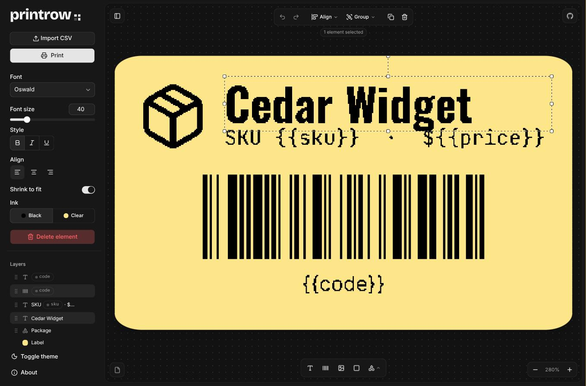
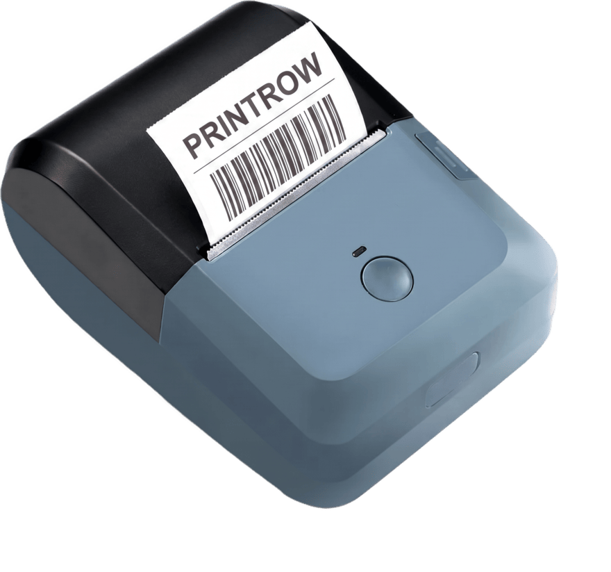

# printrow

[](https://github.com/slastra/yplib)
[](./LICENSE)

**[printrow.lastra.us](https://printrow.lastra.us)** is a label designer that prints against CSV data over Web Bluetooth. No drivers, no installs, no print server: design a label in the browser, bind `{{variables}}` to CSV columns, and batch-print to a **KNAON Y50P** or a **NIIMBOT B1** thermal printer directly from the page.



## What it does

- **Canvas editor**: multi-select, marquee, align and distribute, groups, layer reordering by drag, free rotation, undo/redo, and middle-drag panning.
- **Elements**: text (9 bundled fonts), barcodes and QR (7 symbologies via bwip-js), images, boxes, and any of lucide's ~1,750 icons through a searchable picker.
- **CSV binding**: `{{column}}` resolves straight to a CSV column; no mapping step. Per-column formatting for text, numbers, currency (8 codes), and dates (7 patterns), stored on the template so it survives re-importing next week's file.
- **Batch printing**: print one row or all of them, with a progress bar, cancel, and a printer status check between labels so a jam or open cover stops the run instead of spooling into the void.

## How it works

Both printers speak proprietary framed binary protocols — the Y50P through [yplib](https://github.com/slastra/yplib), the B1 through [nblib](https://github.com/slastra/nblib) — and neither has fonts or barcode symbologies. They accept nothing but a 1-bit bitmap. Everything is rendered host-side, which is what makes the preview trustworthy:

- **A zod model is the single source of truth**; Konva is a view of it. The same node builder feeds the editor canvas and the print rasterizer, so they cannot drift.
- **The preview renders at the printer's real resolution**: 203 dpi, hard 1-bit threshold, Atkinson dithering for photos. The dot grid on screen _is_ the label, stair-steps and all.
- **Barcodes snap their module grid to whole printer dots** at any element size. Fractional modules are what make scaled barcodes both blurry and marginal under a scanner.
- **Stock colour and die-cut shape are preview-only.** The head burns black onto whatever stock is loaded; a coloured background reaching the thresholder would print the label solid black.
- **Transport**: BLE GATT writes in 20-byte chunks with pacing, with bidirectional status (ready / cover open / out of paper) polled between labels.

- **One driver seam** covers both printers, because below it they are shaped nothing alike: YPL streams a framed raster one way, NIIMBOT holds a request/response conversation with a reply expected per command. The app hands a driver a canvas; everything under that belongs to the protocol library.

Both wire formats are unforgiving in the same specific way, worth knowing if you fork this: a raster row that isn't the width the printer was told to expect shifts everything after it and can hang the firmware. Both libraries refuse to encode one rather than transmit it.

**The two heads are not the same width.** The Y50P prints 50 mm (400 dots); the B1 prints **48 mm (384 dots)**, despite taking 50 mm stock. The label panel caps the media picker to the selected printer and refuses to print a design that cannot fit, so a 50 mm template is simply not printable on a B1.

**Print direction is a property of the label**, not of the printer. It says which edge feeds first, which decides which of the design's two dimensions has to fit across the head; `left` rotates the raster a quarter turn. Pick the wrong one and the label prints sideways — invisible on square stock, obvious on anything else. Only the B1 exposes it; YPL always feeds top-first.

## Stack

SvelteKit 2 · Svelte 5 runes · Tailwind 4 · shadcn-svelte · Konva · zod · bwip-js · lucide · yplib · nblib · bun

## Development

```bash
bun install
bun run dev        # http://localhost:5173
bun test src       # CSV parsing, geometry, formatting, row ranges, icon search, printer fit
bun run check      # svelte-check
```

## Deploying

`nixpacks.toml` builds with Bun and starts the adapter-node server, so Coolify needs no extra configuration:

```
bun install --frozen-lockfile  →  bun run build  →  node build
```

There is no database and nothing to persist server-side (templates live in the browser's localStorage, and the printer is reached from the browser), so the server only serves assets and the SSR shell. It listens on `PORT` (the adapter defaults to 3000 on 0.0.0.0). Pushes to `main` redeploy automatically.

**Serve it over HTTPS.** Web Bluetooth only works in a secure context, so on a plain-http origin the Connect button cannot do anything at all.

## Browser support

Web Bluetooth is Chromium-only. Chrome on **Linux** additionally needs `chrome://flags/#enable-web-bluetooth` and a relaunch; `#enable-web-bluetooth-new-permissions-backend` is optional but lets a known printer reconnect with no scan. ChromeOS has it on by default. Everything except printing works in any modern browser.

Discovery deliberately filters by device name, never by service UUID: a service-UUID filter makes Chrome push a `SetDiscoveryFilter` UUID list to BlueZ, which segfaults `bluetoothd` 5.87 on desktop Linux.

## Hardware

<p align="center">
  
</p>

Verified on a **KNAON Y50P**, 50 × 30 mm stock at 8 dots/mm. Other media heights are safe, because the protocol never transmits height: the printer simply takes rows until the raster ends. Widths other than 50 mm follow the captured frame format but have not been tested on real stock.

The **NIIMBOT B1** is also supported: 203 dpi, a 384-dot (48 mm) head, gap / black-mark / transparent stock, and density 1–5.

This hardware is white-labelled, so the printer on your desk may carry a different name. The KNAON unit here and the sibling **FlashToy U8** speak the same protocol, and the vendor Android apps that drive them all wrap the same `com.j0data.sdk` library. Branding is not the discriminator and neither is the USB vendor ID: `0x5958` is unregistered and shared with printers that speak TSPL instead. What settles it is the wire format. Frames that start `1a 01`, end `a1`, and checksum as CRC-32 with init `0xCA896ADE` are this protocol, whatever the label on the case says.

**Have a different NIIMBOT?** Only the B1 is supported here. For the rest of the family use [niimblue](https://github.com/MultiMote/niimblue), a browser label designer built on [niimbluelib](https://github.com/MultiMote/niimbluelib).

## Credits

The Y50P protocol lives in **[yplib](https://github.com/slastra/yplib)**, reverse-engineered from HCI snoops of the manufacturer's Android app and verified by rebuilding whole print sessions byte for byte. Its `FINDINGS.md` is the full derivation.

The B1 protocol lives in **[nblib](https://github.com/slastra/nblib)**, a port of **[niimbluelib](https://github.com/MultiMote/niimbluelib)** (MIT) by [MultiMote](https://github.com/MultiMote) — the reverse-engineering of the NIIMBOT format is entirely their work. nblib exists to be browser-only, dependency-free ESM that discovers by device name rather than by service UUID; its encoder is verified byte for byte against niimbluelib's across hundreds of rasters. Its `ACKNOWLEDGEMENTS.md` records what came from where.

**Have a FlashToy U8?** Go to [Souukou/OpenBluetoothPrinter](https://github.com/Souukou/OpenBluetoothPrinter) (MIT), a separate derivation of the same protocol (they call it YPL) that targets that printer directly. Three status bits in `protocol.ts` come from their work and are credited there.

Bundled and redistributed by this app:

- **[Lucide](https://lucide.dev)** (ISC) for the icon set, ~1,750 marks embedded in the bundle.
- **[bwip-js](https://github.com/metafloor/bwip-js)** (MIT) for barcode and QR generation.
- **[Konva](https://konvajs.org)** (MIT) for canvas rendering, **[zod](https://zod.dev)** (MIT) for the template schema, **[svelte-dnd-action](https://github.com/isaacHagoel/svelte-dnd-action)** (MIT) for layer reordering, and **[shadcn-svelte](https://shadcn-svelte.com)** / **[bits-ui](https://bits-ui.com)** (MIT) for the interface components.
- **Typefaces**, all under the [SIL Open Font Licence 1.1](https://openfontlicense.org), served from [Fontsource](https://fontsource.org): Inter, Pacifico, Oswald, Source Serif 4, JetBrains Mono, Bebas Neue, Archivo Black, Playfair Display, Space Grotesk, and Bricolage Grotesque for the wordmark.

## Licence

MIT
